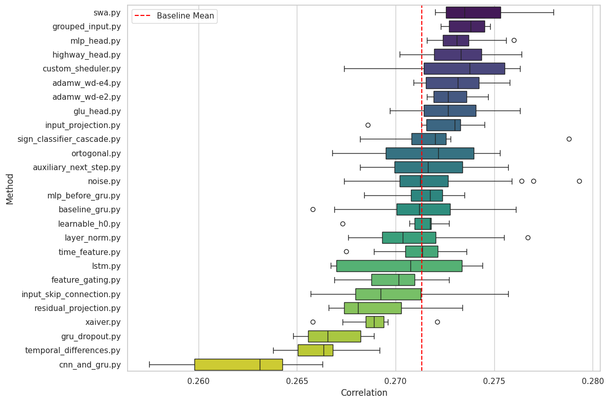
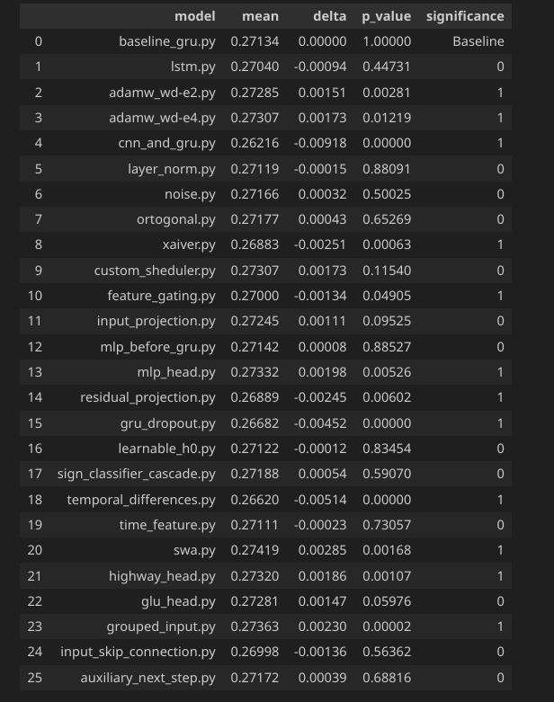

### Final architecture :
1. Input feature vector (1000 steps).
2. Split into price and volume features
3. Forward through two independent MLPs (16 -> 64) with SiLU activation.
4. Concatenation and feed to the recurrent block
5. Gated Residual Blocks (Linear -> GLU -> Residual connection)
6. Linear head

### Some tricks:
1. Perhaps a good solution would be to train the model on a combination of global and local loss. (For example 0.7 * global + 0.3 * local)
   - **Global:** Calculates the correlation for all elements of the batch at once.
   - **Local:** Calculates the correlation separately for each example in the batch, then averages it.
   (But this hypothesis needs to be tested)
2. Ensembling provides a significant boost in accuracy. To improve the metric, you can take models that perform well on t0 and run inference specifically on it. The same applies to t1

